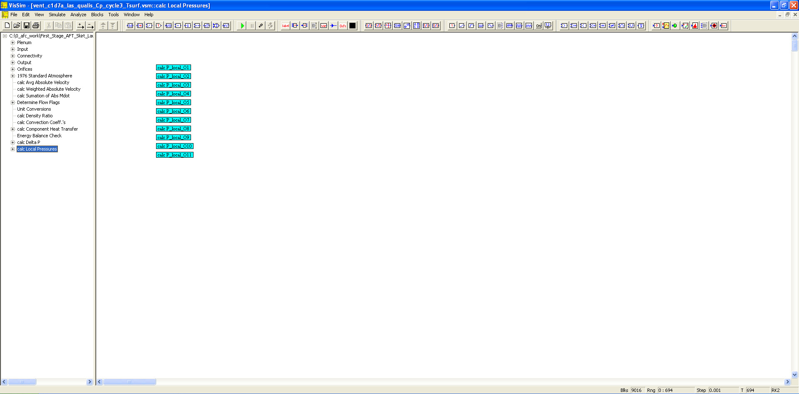

# ========================================
# First Stage AFT Skirt Launch to Touchdown Aeroheating Venting Analysis:
# ========================================

## First Stage AFT Skirt Launch to Touchdown Aeroheating Analysis using VISSIM.

##
## I. Operation: "./VISSIM/First Stage AFT Skirt Launch to Touchdown Aeroheating_c1d7a_las_qualis_Cp_cycle3_Tsurf.vsm"

##
## II. Launch to Touchdown Aeroheating/Venting Top Level Diagram:

##
## III. Plenum Sub-System Level Diagram:

##
## IV. Input Sub-System Level Diagram:

##
## V. Connectivity Sub-System Level Diagram:

##
## VI. Output Sub-System Level Diagram:

##
## VII. Orifices Sub-System Level Diagram:

##
## VIII. 1976 Standard Atmosphere Model Sub-System Level Diagram:

##
## IX. Determine Flow Flags Sub-System Level Diagram:

##
## X. Component Heat Transfer Sub-System Level Diagram:

##
## XI. Calculate Delta Pressures Sub-System Level Diagram:

##
## XII. Calculate Local Pressures Sub-System Level Diagram:

##
## XIIIa. Results: "./VISSIM/lap_aft_skirt_h_q.out"
## XIIIb. Results: "./VISSIM/lap_aft_skirt_mdot.dat"
## XIIIc. Results: "./VISSIM/lap_aft_skirt_plenum.dat"
## XIIId. Results: "./VISSIM/lap_aft_skirt_temp.dat"
## XIIIe. Results: "./VISSIM/lap_aft_skirt_vel.dat"
## 
## *Note: 
## 1. Performance Data and Analysis performed using VISSIM, ( https://web.solidthinking.com/vissim-is-now-solidthinking-embed )

